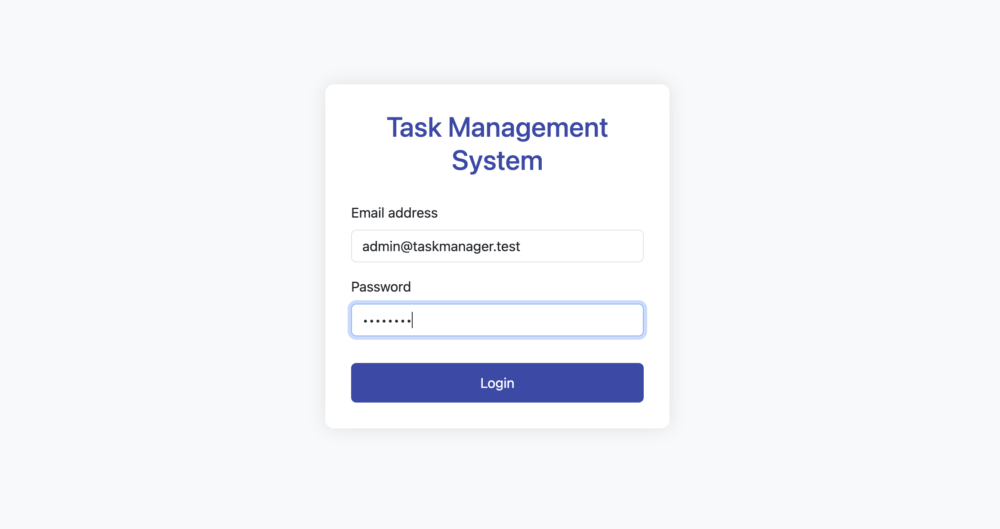
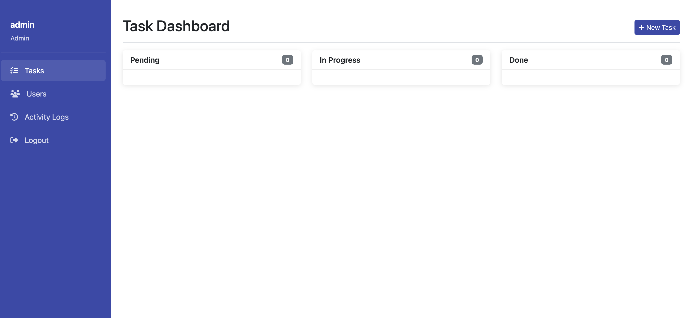

# Task Management System

## 🌟 Overview

This is a task management system built with Laravel backend and Vanilla JS frontend. The system allows different user roles (admin, manager, staff) to manage tasks with different permission levels.

## 🚀 Features

### User Management
- Role-based access control (admin, manager, staff)
- User activation/deactivation
- Secure authentication with Sanctum

### Task Management
- Create, read, update, and delete tasks
- Assign tasks based on role permissions
- Track task status (pending, in-progress, done)
- Due date tracking with automatic overdue detection

### Activity Logging
- Comprehensive activity tracking
- Audit trails for all critical operations
- Automatic logging of task overdue events

## 📚 Tech Stack

### Backend
- Laravel 12.x
- MySQL Database
- Laravel Sanctum for Authentication
- Custom Middleware for Access Control

### Frontend
- Vanilla JavaScript
- HTML5 & CSS3
- Bootstrap 5

## 🏗️ System Architecture

### Entity Structure

#### User
- `id`: UUID
- `name`: string
- `email`: string, unique
- `password`: hashed
- `role`: enum (`admin`, `manager`, `staff`)
- `status`: boolean (active/inactive)

#### Task
- `id`: UUID
- `title`: string
- `description`: text
- `assigned_to`: UUID (relation to User)
- `status`: enum (`pending`, `in_progress`, `done`)
- `due_date`: date
- `created_by`: UUID

#### Activity Logs
- `id`: UUID
- `user_id`: UUID
- `action`: string (create_user, update_task, etc.)
- `description`: text
- `logged_at`: datetime

### Permission Matrix

| Role    | View Users | Manage Tasks | Assign Tasks | View Logs |
|---------|------------|--------------|--------------|-----------|
| admin   | ✅         | ✅           | ✅           | ✅        |
| manager | ✅         | ✅ (own team)| ✅ (staff)   | ❌        |
| staff   | ❌         | ✅ (self)    | ❌           | ❌        |

## 🔒 Business Rules

- Users with `inactive` status cannot log in
- Managers can only assign tasks to staff members
- Users can only see tasks created by them or assigned to them
- Overdue tasks are automatically logged via scheduler

## 🛠️ API Endpoints

| Method | Endpoint      | Description                 | Access                |
|--------|---------------|-----------------------------|----------------------|
| POST   | /login        | User authentication         | Public               |
| GET    | /users        | List all users              | Admin, Manager       |
| POST   | /users        | Create new user             | Admin only           |
| GET    | /tasks        | List tasks (role-filtered)  | All authenticated    |
| POST   | /tasks        | Create new task             | All authenticated    |
| PUT    | /tasks/{id}   | Update existing task        | Role-based           |
| DELETE | /tasks/{id}   | Delete task                 | Admin or Creator     |
| GET    | /logs         | View activity logs          | Admin only           |

## 🧪 Testing

The system includes comprehensive tests:
- Unit tests for business logic
- Feature tests for API endpoints and authentication
- Coverage reporting via `php artisan test`


## ⚙️ Installation

### Prerequisites
- PHP 8.3+
- Composer
- Postgre SQL
- Node.js & NPM (for frontend development)

### Setup Steps
1. Clone the repository
   ```
   git clone https://github.com/umarhadimukti/task-manager-laravel.git
   ```

2. Install dependencies
   ```
   composer install
   ```

3. Set up environment file
   ```
   cp .env.example .env
   ```

4. Generate application key
   ```
   php artisan key:generate
   ```

5. Run migrations
   ```
   php artisan migrate
   ```

6. Seed the database (optional)
   ```
   php artisan db:seed
   ```

7. Start the development server
   ```
   php artisan serve
   ```

## 📝 Usage

1. Access the application at `http://localhost:8000`
2. Log in with credentials based on role:
   - Admin: admin@taskmanager.test / test1234
   - Manager: manager@taskmanager.test / test1234
   - Staff: staff@taskmanager.test / test1234

3. Navigate the dashboard according to your role permissions

## Screenshot


